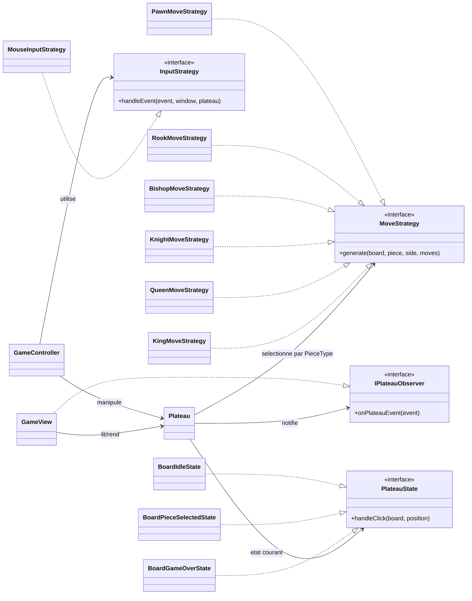

# YaltaChess (SFML 3)

Projet C++/SFML 3 de plateau Yalta (3 joueurs, topologie en 6 sextants, 96 cases), avec architecture orientee patterns.

## Lancer le projet

```powershell
cmake -S . -B build
cmake --build build
./build/YaltaChess.exe
```

Tests de regression mouvements:

```powershell
./build/YaltaChessMoveProbe.exe
```

## Diagramme des patterns



## Choix d'architecture

### 1) MVC (separation des responsabilites)
- **Model**: logique de jeu, topologie, coups, captures, transitions speciales.
- **View**: rendu SFML, HUD (tour du joueur), reaction aux events du modele.
- **Controller**: collecte des inputs fenetre et delegation au modele.

Pourquoi: reduire le couplage entre rendu, input et regles de jeu, et faciliter les tests.

### 2) Strategy
- **Input Strategy**: gestion des entrees remplaçable (`InputStrategy`, `MouseInputStrategy`).
- **Move Strategy**: une strategie par type de piece (`PawnMoveStrategy`, `RookMoveStrategy`, etc.).

Pourquoi: eviter un gros bloc conditionnel unique, rendre chaque regle de piece plus claire et extensible.

### 3) Observer
- Le modele `Plateau` publie des evenements (`BoardReset`, `SelectionChanged`, `PieceSelected`, `InvalidMove`, `CapturePlayed`, `MovePlayed`, `TurnChanged`).
- La vue `GameView` s'abonne et met a jour l'UI sans dependre d'appels directs du controleur.

Pourquoi: decoupler le modele des consommateurs UI, simplifier l'ajout d'autres observateurs (logger, analytics, replay).

### 4) State
- Etat d'interaction du plateau: `BoardIdleState`, `BoardPieceSelectedState`, `BoardGameOverState`.
- Chaque etat encapsule la reaction aux clics.

Pourquoi: eviter une logique de clic monolithique, rendre explicites les transitions d'etat et preparer les evolutions (promotion, game over avance, etc.).

## Organisation des fichiers (resume)

- `src/controller/`: orchestration des inputs et du flux applicatif.
- `src/view/`: rendu et HUD.
- `src/model/PlateauGeometry.cpp`: construction geometrique du plateau.
- `src/model/PlateauSpecialRules.cpp`: regles speciales de topologie/transitions.
- `src/model/PlateauCaptures.cpp`: captures (dont en passant).
- `src/model/PlateauMoves.cpp`: generation des coups.
- `src/model/MovementStrategy.cpp`: strategies de mouvements par piece.
- `src/model/PlateauState.cpp`: machine d'etats d'interaction.
- `tests/MoveProbe.cpp`: scenarios de regression (mouvements + alternance couleurs).

## Notes

- La coloration des cases est validee par test d'adjacence geometrique (`PASS Color alternation adjacency`).
- Le projet cible SFML 3 avec CMake sur Windows/MinGW.
